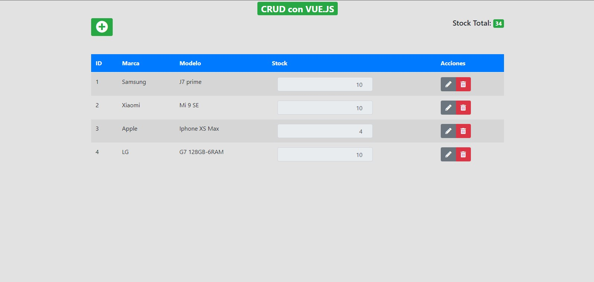

# Proyecto CRUD con Vue.js (CDN), PHP y MySQL (PDO)

#Captura del proyecto

Aquí está una imagen de ejemplo:

Este proyecto es un ejemplo de una aplicación CRUD que utiliza Vue.js desde un CDN en el frontend, PHP en el backend y MySQL con PDO para administrar una base de datos.

## Requisitos

Antes de comenzar, asegúrate de tener instalado lo siguiente:

- Servidor web (por ejemplo, Apache)
- PHP 7.0+
- MySQL

## Configuración

### Backend (PHP)

1. Clona el repositorio en tu servidor web:

git remote add origin https://github.com/sanditor/crud_vue_php_msql_PDO.git

2. Corre la base de datos que está en la carpeta "ScriptBBDD" en tu gestor mysql de preferencia

3. Abre tu navegador y visita http://localhost:8080 (o la URL que hayas configurado en el backend). Deberías ver la aplicación CRUD en funcionamiento, donde puedes crear, leer, actualizar y eliminar registros en la base de datos.

